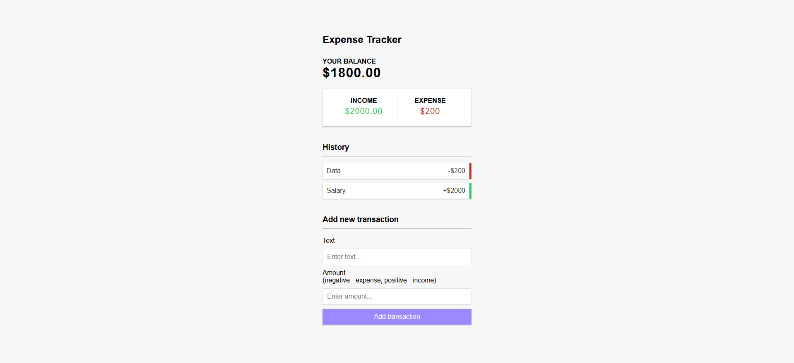

## Table of contents

- [Overview](#overview)
  - [The challenge](#the-challenge)
  - [Screenshot](#screenshot)
  - [Links](#links)
- [My process](#my-process)
  - [Built with](#built-with)
  - [What I learned](#what-i-learned)
  - [Continued development](#continued-development)
  - [Useful resources](#useful-resources)
- [Author](#author)
- [Acknowledgments](#acknowledgments)

## Overview

Thank you for checking out this react application. As part of my effort to build as many react application as possible, I decided to build this expense tracker application.

### Functionality

Users should be able to:

- View the optimal layout for the app depending on their device's screen size
- See hover states for all interactive elements on the page
- Add new transaction
- Delete transaction from the list

### Screenshot



### Links

- Solution URL: (https://github.com/optimist001/expense-tracker)
- Live Site URL: (https://expense-tracker-nine-theta-57.vercel.app/)

## My process

### Built with

- CSS custom properties
- Flexbox
- Mobile-first workflow
- [React](https://reactjs.org/) - JS library

### What I learned

Working on this project reiterate my understanding of:

- react state
- props drilling
- lifting state up
- destructuring

To see how you can add code snippets, see below:

````

```js
const {amount, text, id} = transaction;
};
````

### Continued development

While I learned many concept with this project, I still have many other concept to dig deep to learn on such as:

- add form validation
- drag and drop
- arrange transaction history in ascending order
- change balance style when balance is low

### Useful resources

- (https://www.youtube.com/bradtraversy/Build_an_Expense_Tracker___React_Hooks___Context_API(720p)) - This is an amazing tutorial. It helped me to understand context api

## Author

- Linkedin - [optimist](https://www.linkedin.com/in/tiamiyu-ibraheem/)
- Frontend Mentor - [@optimist001](https://www.frontendmentor.io/profile/optimist001)
- Twitter - [@OlakitanIbrahe2](https://x.com/OlakitanIbrahe2)
- Github - (https://github.com/optimist001)

## Acknowledgments

I acknowledged the author of brad traversy youtube channel. He is an amazing tutor.
